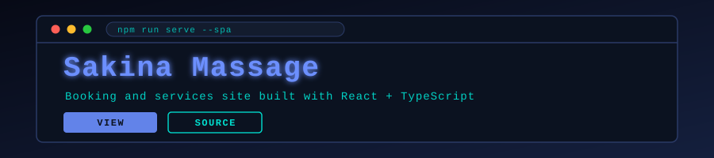

<p align="center">
  
</p>

<p align="center">
  
</p>

<p align="center">
  <a href="https://github.com/muqeetahmaad9/sakina-massage-74/stargazers"></a>
  <a href="https://github.com/muqeetahmaad9/sakina-massage-74/commits"></a>
  
</p>

---

### 📖 Overview

A modern business website for a massage therapy practice: service listings, booking flow and a responsive marketing front end.

### ✨ Features

- Component-driven React front end in TypeScript
- Service catalogue and booking interface
- Responsive design across mobile and desktop

### 🧰 Built With

<p align="left">
  
</p>

### 🚀 Getting Started

```bash
npm install
npm run dev
```

### 👤 Author

**Muqeet Ahmad** — AI/ML Engineer · IoT & Embedded Systems Builder

<p align="left">
  <a href="https://www.linkedin.com/in/muqeet--ahmad/"></a>
  <a href="https://muqeetahmaad-portfolio.netlify.app/"></a>
  <a href="mailto:muqeetahmad155@gmail.com"></a>
</p>

<p align="center">
  
</p>
